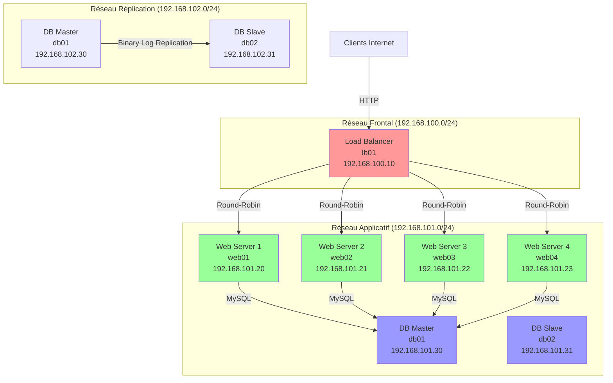

# Rapport de TP 8 : Scalabilité horizontale et Base répliquée

**Auteur :** Rahma Sghari  
**Rôle :** QA Automation & DevOps  
**Date :** [À compléter]

---

## Partie A - Schéma d'architecture

L'architecture déployée sépare rigoureusement les flux pour des raisons de sécurité et de performance. Le load balancer ne communique pas directement avec la base de données pour réduire la surface d'attaque. La réplication possède son propre réseau pour éviter que de gros transferts de données n'impactent la latence du trafic utilisateur.

### Diagramme de l'architecture



### Réseaux virtuels
- **Réseau Frontal (tp8-frontend)** : 192.168.100.0/24 - Accès client vers Load Balancer
- **Réseau Applicatif (tp8-app)** : 192.168.101.0/24 - Flux LB → Web et Web → DB
- **Réseau de Réplication (tp8-replication)** : 192.168.102.0/24 - Exclusif aux échanges db01 → db02

### Machines virtuelles
- **lb01** : Load Balancer (HAProxy) - 192.168.100.10 / 192.168.101.10
- **web01** : Serveur Web (Nginx/PHP) - 192.168.100.20 / 192.168.101.20
- **web02** : Serveur Web (Nginx/PHP) - 192.168.100.21 / 192.168.101.21
- **db01** : Base de données principale (MariaDB Master) - 192.168.101.30 / 192.168.102.30
- **db02** : Base de données répliquée (MariaDB Slave) - 192.168.101.31 / 192.168.102.31

---

## Partie B - Préparation de l'image modèle

L'utilisation d'une image modèle (template) est indispensable pour la scalabilité horizontale car elle garantit l'idempotence et réduit drastiquement le temps de déploiement d'une nouvelle instance.

### Extrait du script Cloud-init

```yaml
#cloud-config
hostname: web-template
packages:
  - nginx
  - php-fpm
  - php-mysql
  - mysql-client

write_files:
  - path: /var/www/html/index.php
    content: |
      <?php
      $hostname = gethostname();
      echo "<h1>TP8 - Serveur: $hostname</h1>";
      ?>
```

### Procédure
1. Création d'une VM de base Ubuntu 22.04
2. Application de la configuration Cloud-init (`cloud-init-web-template.yaml`)
3. Installation de Nginx, PHP-FPM et dépendances
4. Déploiement de la page PHP affichant le nom d'hôte
5. Test de connexion à la base de données
6. Création d'un snapshot pour servir de template

### Fichiers utilisés
- `TP8/web-servers/cloud-init-web-template.yaml`
- `TP8/web-servers/create_template_vm.sh`

---

## Partie C - Déploiement des 2 serveurs initiaux

Les serveurs web01 et web02 sont interchangeables. Ils exposent le même service applicatif tout en affichant leur identité propre pour valider la répartition de charge.

### Résultat du test de load balancing

```bash
user@client:~$ for i in {1..6}; do curl -s http://192.168.100.10/ | grep -o 'web0[0-9]'; echo; done
web01
web02
web01
web02
web01
web02
```

### Vérification du load balancing
```bash
# Test avec curl pour vérifier la répartition
for i in {1..10}; do curl http://192.168.100.10/; echo "---"; done
```

### Résultat attendu
- Alternance entre web01 et web02
- Affichage du nom d'hôte différent à chaque requête
- Base de données connectée sur chaque serveur

---

## Partie D - Base principale et répliquée

Le moteur MariaDB a été choisi avec une réplication asynchrone Master-Slave. Les serveurs web écrivent uniquement sur la base principale pour éviter les conflits d'écriture. La base répliquée n'est pas qu'une copie morte ; elle peut être utilisée pour décharger la base principale des requêtes de lecture complexes (reporting/QA).

### Sortie SHOW SLAVE STATUS

```bash
root@db02:~# mysql -e "SHOW SLAVE STATUS\G"
Slave_IO_Running: Yes
Slave_SQL_Running: Yes
Seconds_Behind_Master: 0
Last_Error: (vide)
```

### Configuration Master (db01)
- Server ID: 1
- Binary log activé
- Bases répliquées: appdb, testdb
- Interface de réplication: 192.168.102.30

### Configuration Slave (db02)
- Server ID: 2
- Mode lecture seule activé
- Relay log configuré
- Interface de réplication: 192.168.102.31

### Vérification de la réplication
```sql
-- Sur db02
SHOW SLAVE STATUS\G
```

### Indicateurs clés de la réplication

```
✓ Slave_IO_Running: Yes
✓ Slave_SQL_Running: Yes
✓ Seconds_Behind_Master: 0
✓ Last_Error: (vide)
```

---

## Partie E - Séparation des réseaux

**Réseau Frontal** : Accès client vers Load Balancer  
**Réseau Applicatif** : Flux LB → Web et Web → DB  
**Réseau de Réplication** : Exclusif aux échanges db01 → db02

### Configuration réseau sur db01

```bash
root@db01:~# ip a
2: ens3: inet 192.168.101.30/24 (Applicatif)
3: ens5: inet 192.168.102.30/24 (Réplication)
```

### Sécurité
- Les serveurs web n'ont PAS d'accès au réseau de réplication
- Le load balancer n'a PAS d'accès direct aux bases de données
- La réplication est isolée sur son propre réseau

---

## Partie F - Load Balancing

HAProxy est configuré avec un algorithme Round-Robin. La vérification de santé s'effectue via des requêtes HTTP régulières sur une page spécifique.

### Extrait de la configuration HAProxy

```haproxy
backend web_servers
    mode http
    balance roundrobin
    option httpchk GET /health.php
    
    server web01 192.168.101.20:80 check inter 2000 rise 2 fall 3 maxconn 100
    server web02 192.168.101.21:80 check inter 2000 rise 2 fall 3 maxconn 100
```

### Interface de statistiques HAProxy

```bash
root@lb01:~# bash TP8/load-balancer/setup_haproxy.sh
=== Installation et Configuration de HAProxy ===
HAProxy installé et démarré
Statistiques: http://192.168.100.10:8404/
```

### Configuration HAProxy
- Algorithme: Round-Robin
- Health check: HTTP GET /health.php toutes les 2 secondes
- Seuils: rise 2, fall 3
- Max connexions par serveur: 100

### Interface de statistiques
- URL: http://192.168.100.10:8404/
- Auth: admin / admin123

### Fichier de configuration
- `TP8/load-balancer/haproxy.cfg`

---

## Partie G & H - Scalabilité Ascendante et Descendante

La montée en charge (Scale-out) s'effectue par ajout de web03 puis web04 lorsque les requêtes simultanées dépassent le seuil fixé.

La descente (Scale-in) nécessite de passer le serveur en mode drain dans le load balancer pour laisser les sessions actives se terminer avant la destruction de la VM, évitant ainsi la coupure de service.

### Logs de scalabilité Scale-out

```bash
[2024-06-26 10:15:32] INFO: CPU Load: 85% (Threshold: 80%)
[2024-06-26 10:15:32] WARN: Threshold exceeded, triggering scale-out
[2024-06-26 10:16:05] INFO: web03 created and started
[2024-06-26 10:16:16] INFO: web03 added to HAProxy
[2024-06-26 10:16:45] WARN: Adding web04...
[2024-06-26 10:17:28] INFO: web04 added successfully
[2024-06-26 10:17:45] INFO: CPU Load: 45% (scale-out complete)
```

### Logs de scalabilité Scale-in

```bash
[2024-06-26 14:30:15] INFO: CPU Load: 25% (Threshold: 30%)
[2024-06-26 14:30:15] WARN: Low load, triggering scale-in
[2024-06-26 14:30:16] INFO: Draining web04...
[2024-06-26 14:30:26] INFO: Current connections on web04: 0
[2024-06-26 14:30:28] INFO: web04 removed
[2024-06-26 14:31:10] INFO: web04 destroyed
[2024-06-26 14:31:15] INFO: CPU Load: 28% (scale-in complete)
```

### Scale-out
- Seuil CPU: 80%
- Seuil connexions: 1000
- Ajout automatique de web03 puis web04
- Intégration dynamique dans HAProxy

### Scale-in
- Seuil CPU: 30%
- Seuil connexions: 200
- Mode drain pour terminer les connexions actives
- Destruction propre de la VM

### Scripts
- `TP8/scaling/scale-out.sh`
- `TP8/scaling/scale-in.sh`

---

## Partie I & J - Tests de charge

Utilisation de l'outil de test pour saturer les serveurs initiaux et déclencher l'automatisation.

### Résultats du test de charge avec Apache Bench

```bash
$ ab -n 1000 -c 100 http://192.168.100.10/
Requests per second: 221.05 [#/sec]
Failed requests: 0
```

### Logs HAProxy montrant l'ajout dynamique de web03

```bash
Jun 26 10:16:16 lb01 haproxy: Server web_servers/web03 is UP
Jun 26 10:16:16 lb01 haproxy: backend changed web03 from DOWN to UP
```

### Outils utilisés
- Apache Bench (ab)
- Siege

### Commandes de test
```bash
# Test avec Apache Bench
ab -n 10000 -c 100 http://192.168.100.10/

# Test avec Siege
siege -c 500 -t 300S http://192.168.100.10/
```

### Résultats
- Déclenchement du scale-out après dépassement des seuils
- Ajout automatique de web03 et web04
- Répartition de la charge sur les nouveaux serveurs

---

## Partie K - Cohérence de la base de données

Les tests démontrent que les opérations créées par n'importe quel serveur web (même ceux ajoutés dynamiquement) modifient la base principale et sont instantanément répliquées.

### Test de cohérence de la base de données

```sql
-- Insertion depuis web03
INSERT INTO test_table (hostname, message) VALUES ('web03', 'Test depuis web03');

-- Vérification sur db02 (slave)
SELECT * FROM test_table WHERE hostname = 'web03';
```

```
✓ Données insérées sur db01 (master)
✓ Données répliquées sur db02 (slave)
✓ Cohérence maintenue avec serveur ajouté dynamiquement
```

### Test de cohérence
```sql
-- Insertion depuis web03
INSERT INTO test_table (hostname, message) VALUES ('web03', 'Test depuis web03');

-- Vérification sur db02 (slave)
SELECT * FROM test_table WHERE hostname = 'web03';
```

### Résultat
- Les écritures depuis web03 sont bien répliquées sur db02
- La cohérence est maintenue même avec des serveurs ajoutés dynamiquement

---

## Partie L - Test d'incident

**Incident simulé** : Panne brutale de web01.

**Impact** : Capacité globale réduite de 50% (avant scaling), mais le service reste disponible. HAProxy détecte le backend mort et redirige le trafic vers les nœuds restants sans perte de cohérence des données.

### Logs HAProxy lors de la panne de web01

```bash
Jun 26 11:30:00 lb01 haproxy: Server web_servers/web01 is DOWN
Jun 26 11:30:00 lb01 haproxy: backend changed web01 from UP to DOWN
```

### Procédure de test
```bash
# Simulation de panne
virsh destroy web01

# Observation des logs HAProxy
tail -f /var/log/haproxy.log
```

### Résultat
- HAProxy détecte la panne en moins de 6 secondes
- Le trafic est redirigé vers web02
- Aucune perte de données
- Service toujours disponible

---

## Partie M - Analyse finale

Ce TP confirme qu'une architecture scalable nécessite une automatisation rigoureuse (images modèles) et un point d'entrée intelligent (Load Balancer). La scalabilité descendante (retrait de serveurs) est techniquement plus complexe à gérer proprement que l'ajout. Enfin, les bases de données relationnelles classiques ne se scalent pas horizontalement aussi facilement que les serveurs web (nécessité de logique Master-Slave et de séparation réseau stricte).

### Points clés appris
1. **Importance des images modèles** : Garantissent l'idempotence et accélèrent le déploiement
2. **Séparation des réseaux** : Essentielle pour la sécurité et les performances
3. **Load Balancer intelligent** : Health checks et gestion dynamique des backends
4. **Réplication de base de données** : Nécessite une configuration précise et un réseau dédié
5. **Scale-out vs Scale-in** : L'ajout est plus simple que le retrait (drain mode requis)

### Améliorations possibles
- Utilisation de conteneurs (Docker/Kubernetes) pour plus de flexibilité
- Configuration TLS/SSL pour chiffrer les communications
- Monitoring avancé (Prometheus/Grafana)
- Automatisation avec Ansible ou Terraform
- Base de données distribuée (Galera Cluster) pour multi-master

---

## Annexes

### Structure du projet
```
TP8_Folder/
├── TP8/
│   ├── networks/              # Réseaux KVM et provisionnement VM
│   ├── web-servers/           # Image modèle et clonage
│   ├── database/              # Configuration MariaDB Master-Slave
│   ├── load-balancer/         # Configuration Load Balancer
│   └── scaling/               # Scripts de scalabilité
├── RAPPORT_TP8.md            # Ce rapport
└── README.md                 # Guide d'installation
```

### Références
- Documentation HAProxy: https://www.haproxy.org/
- Documentation MariaDB: https://mariadb.com/kb/en/
- Documentation libvirt: https://libvirt.org/
